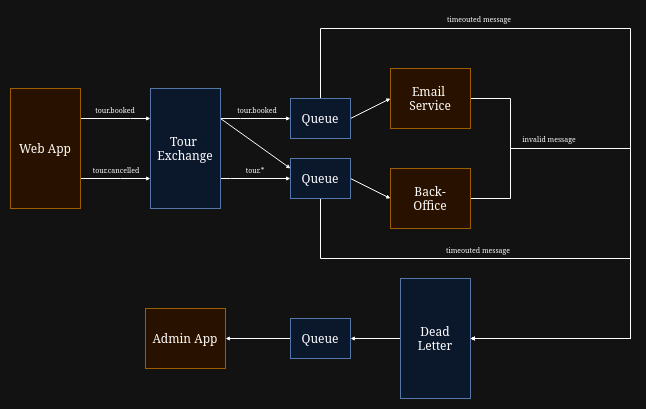

- Run `docker compose up`

- Go to http://localhost:8080

- Fill out form and submit

- Verify that checked "Booking" get send to EmailService and BackOffice and that "Cancel" only is sent to BackOffice. 

- Fill out form and check "Invalid Message Test".

- Verify that "Admin App" receives messages from the "Dead Letter Channel"